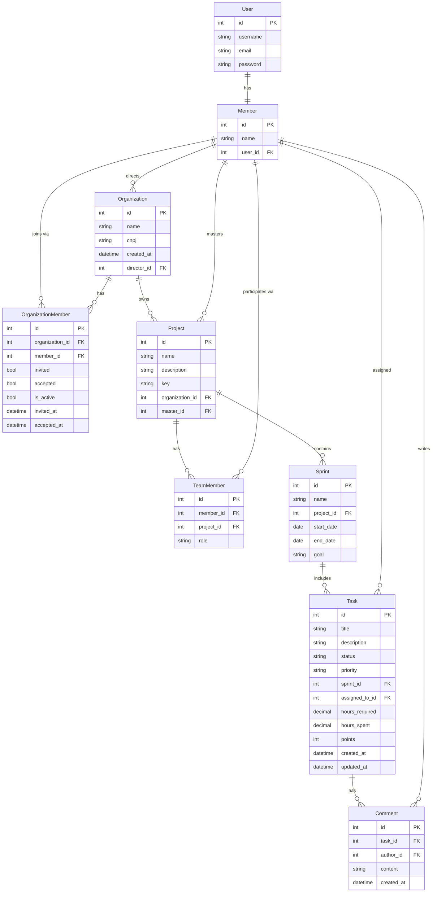

# Diagrama Entidade-Relacionamento

Modelo de dados do Scrum Master API.

```mermaid
erDiagram
  User {
    int id PK
    string username
    string email
    string password
  }

  Member {
    int id PK
    string name
    int user_id FK
  }

  Organization {
    int id PK
    string name
    string cnpj
    datetime created_at
    int director_id FK
  }

  OrganizationMember {
    int id PK
    int organization_id FK
    int member_id FK
    bool invited
    bool accepted
    bool is_active
    datetime invited_at
    datetime accepted_at
  }

  Project {
    int id PK
    string name
    string description
    string key
    int organization_id FK
    int master_id FK
  }

  TeamMember {
    int id PK
    int member_id FK
    int project_id FK
    string role
  }

  Sprint {
    int id PK
    string name
    int project_id FK
    date start_date
    date end_date
    string goal
  }

  Task {
    int id PK
    string title
    string description
    string status
    string priority
    int sprint_id FK
    int assigned_to_id FK
    decimal hours_required
    decimal hours_spent
    int points
    datetime created_at
    datetime updated_at
  }

  Comment {
    int id PK
    int task_id FK
    int author_id FK
    string content
    datetime created_at
  }

  User ||--|| Member : "has"
  Member ||--o{ OrganizationMember : "joins via"
  Organization ||--o{ OrganizationMember : "has"
  Member ||--o{ Organization : "directs"
  Organization ||--o{ Project : "owns"
  Member ||--o{ Project : "masters"
  Project ||--o{ TeamMember : "has"
  Member ||--o{ TeamMember : "participates via"
  Project ||--o{ Sprint : "contains"
  Sprint ||--o{ Task : "includes"
  Member ||--o{ Task : "assigned"
  Task ||--o{ Comment : "has"
  Member ||--o{ Comment : "writes"
```